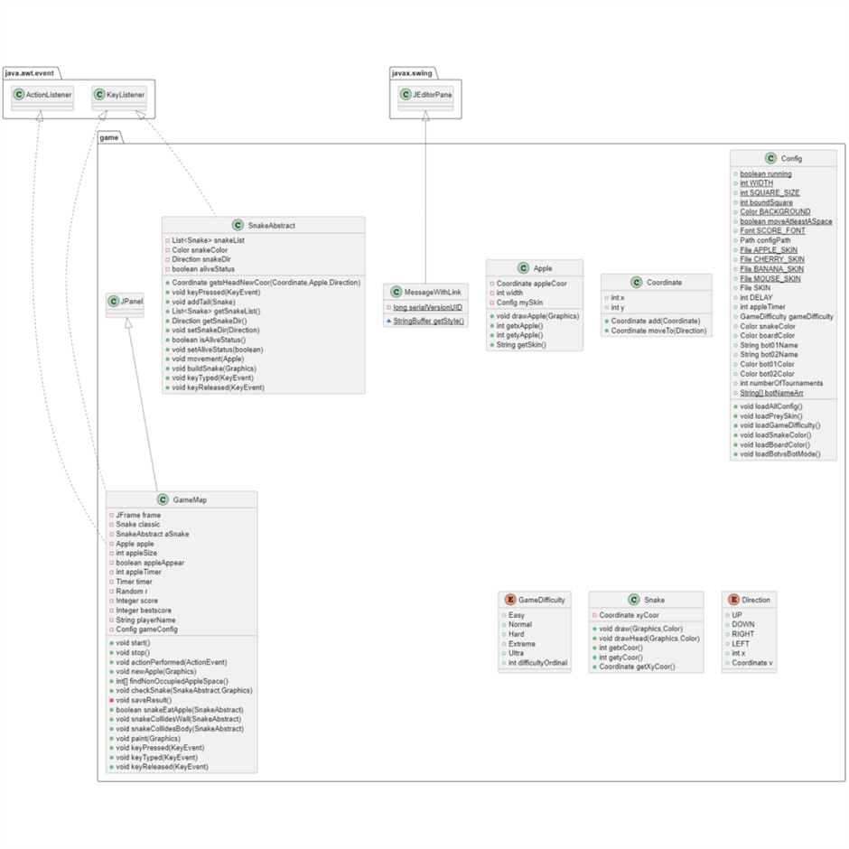

# Snake AI Revolution

## Set up the project 

### Requirement

- JDK 14 or the latest

- Java IDE: Intellij Idea (recommend), Eclipse, Visual Studio Code, or NetBeans

### Clone the repository

Clone the repo using git

```SSH```
```
git clone git@github.com:vhtua/SnakeAIRevolution.git
```

or

```HTTPS```
```
git clone https://github.com/vhtua/SnakeAIRevolution.git
```
or simply download the .zip file

## Open the project

Open SnakeAIRevolution.ipr in Intellij or any other IDE. (Here we use
Intellij)


1.  Set up the JDK


    - Open Project Structure

        

    - Choose the correct JDK version and project language level, the language level of this project is 14

        

2.  Set up a configuration
    - Open the configuration settings

        

    - Set the correct JRE version for RunMain

        

3.  Launch the Project

    The game is already set up, simply compile and launch the game by
    Pressing Shift + F10 or Run |> Run 'RunMain' in the menu

    

## GUI Details

### **Main Screen (Start Screen)**

The start screen of the game consists of 6 functional buttons

> **'SINGLE PLAYER'**: play a classic snake game, move your snake to eat as many apples as possible, the objective is to achieve the highest length of the snake.

> **'BOT VS BOT'**: a game of 2 snake bots competing against each other.

> **'SETTINGS'**: all the settings for Single Player Mode and Bot Vs Bot Mode.

> **'STATISTICS'**: all the statistics for Single Player Mode and Bot Vs Bot Mode (score, game difficulty, prey type, date and time)

> **'QUIT GAME'**: quit the game

> **'Credits'**: general information about the authors and the project


### **Game Settings**

- Click the 'SETTINGS' button to open the settings of the game
    > (recommend opening settings before playing any game mode)

    

- Now the game settings window appears.

    > In the Single Player Mode, you can modify the overall game difficulty
    > (Easy, Normal, Hard, Extreme, Ultra), game board color (black, gray,
    > violet, brown, periwinkle), your snake color (red, blue, yellow,
    > green, white, sky blue), and prey type (apple, banana, cherry, mouse)

    > In the Bot vs Bot Mode, you can choose two bots, modify their bodies\'
    > color, and the number of rounds they compete against each other.

    > After modifying all changes, make sure to click 'Apply Changes' to
    > apply all your settings for the game.

    

### **Single Player Mode**

Click the ```SINGLE PLAYER``` button on Start Screen to start playing in the Single Player Mode.


The main screen of the Single Player Mode contains:

- The score of the game is on the top-left of the game board, each time the snake eats the apple, the score will increase by 1.

- The initial position of the Snake is also on the top-left of the game board, with the white head facing to the right side.

- The prey (apple, banana, etc). If the project fails to load the image of the prey, it will be represented by a red circle.

> To start playing Single Player Mode, you have to press the Space key on the keyboard.


The game will end when one of those cases happens:

- The snake collides with the border of the game board

- The snake collides with itself.

- There is no space for the apple to spawn.

> After the Single Player Mode ends, you will be brought back to the
> Start Screen.

### **Bot Vs Bot Mode**

Click the ```BOT VS BOT``` button on Start Screen to start spectating 2 bots competing in the Bot Vs Bot Mode.


This mode will look like this:


- The score between two bots of each round is stored under the folder location: 
  > \<project_root\>/logs/iteration\_\<#numerical_order\>.txt

- The total score between two bots of a complete n-rounds is stored under the folder location: 
  > \<project_root\>/logs/total.txt

    

### **Statistics**

Click the ```STATISTICS``` button on the Start Screen to view the Statistics of both Single Player Mode and Bot Vs Bot.


Here the Statistics window will open

1. Single Player Statistics

    

- By default, the project will open the Single Player Statistics first. If are in the Bot vs Bot Statistic, click the ```◀ SinglePlayer Statistics``` button to open the Single Player Statistics.

- This Statistics board sorts the scores from the highest to the lowest of the Single Player Mode

- contains information about the score, game difficulty, prey type, date and time of a Single Player game.

2. Bot vs Bot Statistics


- If are in the Single Player Statistic, click the ```BotvsBot Statistics ▶``` button to open the Bot Vs Bot Statistics.

- This Statistics board contains all head-to-head scores between all possible 2-bots couples.

### **Quit game**

To exit the game, simply click the ```QUIT GAME``` button on the Start Screen then click 'Yes' to confirm.


## UML Class Diagram {#uml-class-diagram .unnumbered}

There are 5 main Packages of the Project

1.  **bot**

    

    > [[https://i.imgur.com/dUWglFh.png]{.underline}](https://i.imgur.com/dUWglFh.png)
    
    This package contains an Interface to implement the Bot and all the Bots of the Bot Vs Bot Mode.

2.  **defaultbotframework**

    

    > [[https://i.imgur.com/FhNWBnZ.png]{.underline}](https://i.imgur.com/FhNWBnZ.png)

    This package contains all the necessary frameworks to implement a smooth GUI playground for 2 bots competing.

3.  **game**

    

    > [[https://i.imgur.com/qgScly7.png]{.underline}](https://i.imgur.com/qgScly7.png)

    This package contains all classes for a GUI Classic Snake game (Single Player Mode)

4.  **gui**

    

    > [[https://i.imgur.com/gs7bUzH.png]{.underline}](https://i.imgur.com/gs7bUzH.png)
    
    This package implements a GUI for the Start Screen for the Project

5.  **score**

    

    > [[https://i.imgur.com/iLbXqWD.png]{.underline}](https://i.imgur.com/iLbXqWD.png)

    This package contains vital classes for comparing and sorting scores for the Statistics of the game
